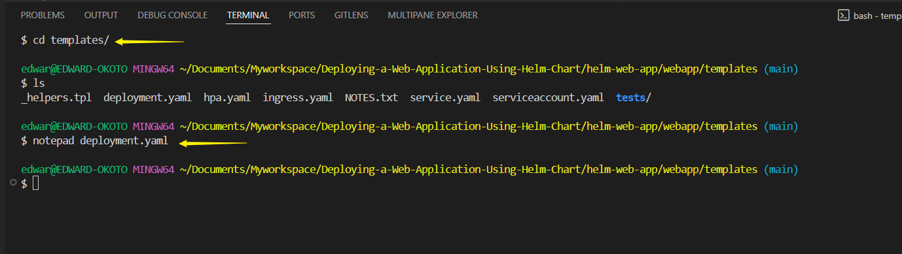

# Deploying-a-Web-Application-Using-Helm-Chart
# Introduction To Helm Charts

Helm is a powerful package manager designed for Kubernetes, simplifying the deployment and management of applications within Kubernetes clusters. It allows developers and operators to package, configure, and deploy applications using pre-configured templates called **charts**.

---

### **Key Features of Helm**
1. **Charts**: Helm packages are called charts, which contain YAML configuration files and templates to define Kubernetes resources.
2. **Dependency Management**: Helm automatically handles dependencies between charts.
3. **Version Control**: Helm tracks versions of charts and releases, making upgrades and rollbacks seamless.
4. **Repositories**: Helm charts are stored in repositories, such as Bitnami, which provide pre-packaged charts for popular applications.
5. **Ease of Use**: Helm simplifies complex Kubernetes deployments by reducing the need for writing detailed YAML manifests.

---

### **How Helm Works**
- **Helm CLI**: The command-line tool (`helm`) is used to interact with Helm.
- **Charts**: Charts are the packaging format for Helm, containing templates and configuration files.
- **Releases**: When a chart is deployed, Helm creates a release, which is a specific instance of the chart running in the cluster.

---

## Overview

In this project,we will deploy a simple web application in a kubernetes cluster using Helm. This project covers using Helm charts,customizing deployments with templates and values,installing and running helm and integrating helm into a basic CI/CD process.


---

# **Helm Installation**

### **Step-by-Step Helm Installation for Linux Users**

**Pre-Installation**

Follow this link to complete the download and installation of **vscode**  [download vscode](https://code.visualstudio.com/download)

**Open Your vscode**
 - Run your vscode as an administrator
 - Access your CLI by opening the Terminal

  


#### **1. Download Helm**
Begin by downloading the latest Helm release:

For Linux
```bash
curl -LO https://get.helm.sh/helm-v3.12.0-linux-amd64.tar.gz -o helm.tar.gz
```

For macOs

```bash
curl -L https://get.helm.sh/helm-v3.5.0-darwin-amd64.tar.gz -o helm.tar.gz
```

- **What does this do?**
  - `curl`: Fetches files from a URL.
  - `-LO`: Ensures the file is downloaded to your current directory.
  - Replace `v3.12.0` with the latest version listed on the [Helm Releases Page](https://github.com/helm/helm/releases).
  - `-o helm.tar.gz` option specifies the output file name
    - `-o`: This flag tells `curl` where to save the downloaded content instead of displaying it directly in the terminal.
    - `helm.tar.gz`: This is the name of the file where the downloaded content will be stored. In this case, you're saving the Helm archive (`.tar.gz`) as `helm.tar.gz`.


#### **2. Extract the Helm Archive**
Once downloaded, extract the compressed `.tar.gz` file:
```bash
tar -xvzf helm.tar.gz
```
- **Explanation:**
  - `tar -xvzf`: Unpacks the archive (`x` for extract, `v` for verbose, `z` for gzip, `f` specifies the file).
  - After extraction, a directory named `helm` will appear, containing the Helm binary.

#### **3. Move the Helm Binary**
To make Helm accessible from anywhere, move the binary to a directory in your system’s PATH:

For Linux

```bash
sudo mv linux-amd64/helm /usr/local/bin/helm
```

For macOs

```bash
sudo mv darwin-amd64/helm /usr/local/bin/helm
```


- **What does this do?**
  - Moves the `helm` file to `/usr/local/bin`, a common location for system-wide binaries.
  - `sudo` is required because `/usr/local/bin` needs administrator privileges.

#### **4. Verify the Installation**
Check if Helm is installed and operational:
```bash
helm version
```
You should see details about the Helm version and build, confirming a successful installation.

#### **5. Clean up**

```bash
rm helm.tar.gz && rm -r *-amd64
```

---

**Alternatively**: Install helm on macOS using `Homebrew`

#### **Step-by-Step Helm Installation for macOS Users**

#### **Using Homebrew**
Homebrew is the easiest way to install Helm on macOS.

1. Install Helm:
   ```bash
   brew install helm
   ```
2. Verify the installation:
   ```bash
   helm version
   ```
   - **Why Homebrew?**
     - It’s a package manager for macOS that simplifies software installation, updates, and removal.

---

#### **Step-by-Step Helm Installation for Windows Users**

**Open Your vscode**
 - Run your vscode as an administrator
 - Access your CLI by opening the Terminal

  

#### **Option 1: Using Chocolatey**
Install Chocolatey [chocolatey](https://chocolatey.org/) : **Chocolatey** is a package manager for Windows that simplifies software installation, updates, and management via the command line. It automates tasks and handles dependencies efficiently, making it ideal for developers and IT professionals.

If you have Chocolatey installed: 
1. Install Helm:
   ```powershell
   choco install kubernetes-helm
   ```
2. Verify the installation:
   ```powershell
   helm version
   ```

#### **Option 2: Using Scoop**
Alternatively, if you use Scoop:
1. Install Helm:
   ```powershell
   scoop install helm
   ```
2. Check the version:
   ```powershell
   helm version
   ```

#### **Option 3: Manual Installation**
1. **Download Helm**:
   - Go to the [Helm Releases Page](https://github.com/helm/helm/releases) and download the latest `.zip` file for Windows.

2. **Extract the File**:
   - Extract the `.zip` archive using tools like WinRAR or 7-Zip.
   - Locate the `helm.exe` file.

3. **Add Helm to PATH**:
   - Move `helm.exe` to a folder included in your system PATH, or manually add its location to PATH.
   - Restart your terminal to apply changes.

4. **Verify the Installation**:
   - Open Command Prompt or PowerShell:
     ```powershell
     helm version
     ```
        
---
## **Create a New Helm Chart**

1.**Create  Project Directory**

```
mkdir helm-web-app

cd helm-web-app
```


2.**Create a New Chart**

```bash
helm create webapp
```


3.**Initialize a git repository**

```
git init
git add .
git commit -m "Initial Helm webapp chart"
```

4.**Push to Remote Repository**

```
git push
```

---

# Customize Helm Chart

Helm charts, values, and templates are the core components of Helm, a Kubernetes package manager. 

---

#### **1. Helm Charts**
A Helm chart is a collection of files that define Kubernetes resources for deploying an application. It simplifies the deployment process by bundling all necessary configurations into a reusable package.

#### **Structure of a Helm Chart**
- **Chart.yaml**: Contains metadata about the chart, such as its name, version, and description.
- **values.yaml**: Defines default configuration values for the chart.
- **templates/**: Contains template files that generate Kubernetes manifests based on the values provided.
- **charts/**: Holds dependencies for the chart.
- **README.md**: Provides documentation for the chart.

Charts can be used to deploy simple applications (e.g., a single pod) or complex ones (e.g., a web app stack with databases and caches).

---

#### **2. Values**
The `values.yaml` file is used to define default configuration values for a Helm chart. These values can be overridden during deployment to customize the application for different environments (e.g., development, staging, production).

#### **How Values Work**
- **Default Values**: Specified in `values.yaml`.
- **Override Values**: You can override defaults using a custom values file or command-line flags:
  ```bash
  helm install my-release my-chart --values=my-values.yaml
  ```
- **Dynamic Configuration**: Values are passed to templates to dynamically generate Kubernetes manifests.

---

#### **3. Templates**
Templates are files in the `templates/` directory that use Go's templating language to generate Kubernetes manifests. They allow you to create dynamic configurations based on the values provided.

##### **How Templates Work**
- Templates use placeholders like `{{ .Values.key }}` to insert values from `values.yaml`.
- They support conditional logic, loops, and functions for advanced customization.
- Example template for a Kubernetes Deployment:
  ```yaml
  apiVersion: apps/v1
  kind: Deployment
  metadata:
    name: {{ .Values.name }}
  spec:
    replicas: {{ .Values.replicas }}
    template:
      spec:
        containers:
        - name: {{ .Values.containerName }}
          image: {{ .Values.image }}
  ```

---

#### **How They Work Together**
1. **Chart**: Provides the structure and files needed for deployment.
2. **Values**: Supplies configuration data to customize the deployment.
3. **Templates**: Dynamically generate Kubernetes manifests using the values provided.

---

### Exploring the `webapp` Directory of our project
- Navigate to the `webapp` directory created by Helm,inside,you will find
    - `chart.yaml`: Contains metadata about the chart such as name,version and description.
    - `values.yaml`: Provides configuration values that helm will inject into the template.Here you set default configuration values.
    - `templates/`: Contains the template files that will generate kubernetes manifest files.These templates references the values defined in the `values.yaml`

```
cd webapp/

ls
```


### Modify `values.yaml`

- Open `values.yaml` in a text editor
 
    ```
    vi values.yaml
    ```

- Set the image to use the Nginx stable version

    ```
    replicaCount: 2

    image:
    repository: nginx
    tag: stable
    pullPolicy: IfNotPresent
    ```

    


- The configuration will deploy two replicas (`replicaCount: 2`) of the Nginx server.

- Save changes.


### Customize the  `templates/deployment.yaml`

- Open the `deployment.yaml` file in the `templates/` directory.

    

- Remove the line below from under  `spec.template.spec.containers.resources`

    ```
    {"{- toYaml .Values.resources | nindent 12 "}}
    ``
- Add a simple resource request and limit under `spec.template.spec.containers.resources`.This helps kubernetes manages resources efficiently.
 
    ```
    resources:
    requests:
        memory: "128Mi"
        cpu: "100m"
    limits:
        memory: "256Mi"
        cpu: "200m"
    ```
- These settings specify that the deployment should request 128Mi of memory and 100m of CPU but it wont use more than 236mi of memory and 200m of CPU.

- Save the file after making changes.

    ```
    apiVersion: apps/v1
    kind: Deployment
    metadata:
    name: {{ include "webapp.fullname" . }}
    labels:
        {{- include "webapp.labels" . | nindent 4 }}
    spec:
    {{- if not .Values.autoscaling.enabled }}
    replicas: {{ .Values.replicaCount }}
    {{- end }}
    selector:
        matchLabels:
        {{- include "webapp.selectorLabels" . | nindent 6 }}
    template:
        metadata:
        {{- with .Values.podAnnotations }}
        annotations:
            {{- toYaml . | nindent 8 }}
        {{- end }}
        labels:
            {{- include "webapp.labels" . | nindent 8 }}
            {{- with .Values.podLabels }}
            {{- toYaml . | nindent 8 }}
            {{- end }}
        spec:
        {{- with .Values.imagePullSecrets }}
        imagePullSecrets:
            {{- toYaml . | nindent 8 }}
        {{- end }}
        serviceAccountName: {{ include "webapp.serviceAccountName" . }}
        {{- with .Values.podSecurityContext }}
        securityContext:
            {{- toYaml . | nindent 8 }}
        {{- end }}
        containers:
            - name: {{ .Chart.Name }}
            {{- with .Values.securityContext }}
            securityContext:
                {{- toYaml . | nindent 12 }}
            {{- end }}
            image: "{{ .Values.image.repository }}:{{ .Values.image.tag | default .Chart.AppVersion }}"
            imagePullPolicy: {{ .Values.image.pullPolicy }}
            ports:
                - name: http
                containerPort: {{ .Values.service.port }}
                protocol: TCP
            {{- with .Values.livenessProbe }}
            livenessProbe:
                {{- toYaml . | nindent 12 }}
            {{- end }}
            {{- with .Values.readinessProbe }}
            readinessProbe:
                {{- toYaml . | nindent 12 }}
            {{- end }}
            resources:
                requests:
                memory: "128Mi"
                cpu: "100m"
                limits:
                memory: "256Mi"
                cpu: "200m"
            {{- with .Values.volumeMounts }}
            volumeMounts:
                {{- toYaml . | nindent 12 }}
            {{- end }}
        {{- with .Values.volumes }}
        volumes:
            {{- toYaml . | nindent 8 }}
        {{- end }}
        {{- with .Values.nodeSelector }}
        nodeSelector:
            {{- toYaml . | nindent 8 }}
        {{- end }}
        {{- with .Values.affinity }}
        affinity:
            {{- toYaml . | nindent 8 }}
        {{- end }}
        {{- with .Values.tolerations }}
        tolerations:
            {{- toYaml . | nindent 8 }}
        {{- end }}
        
    ```

- Commit and Push changes

    ```
    git add .
    git commit -m "Customized Helm chart"
    git push
    ```
